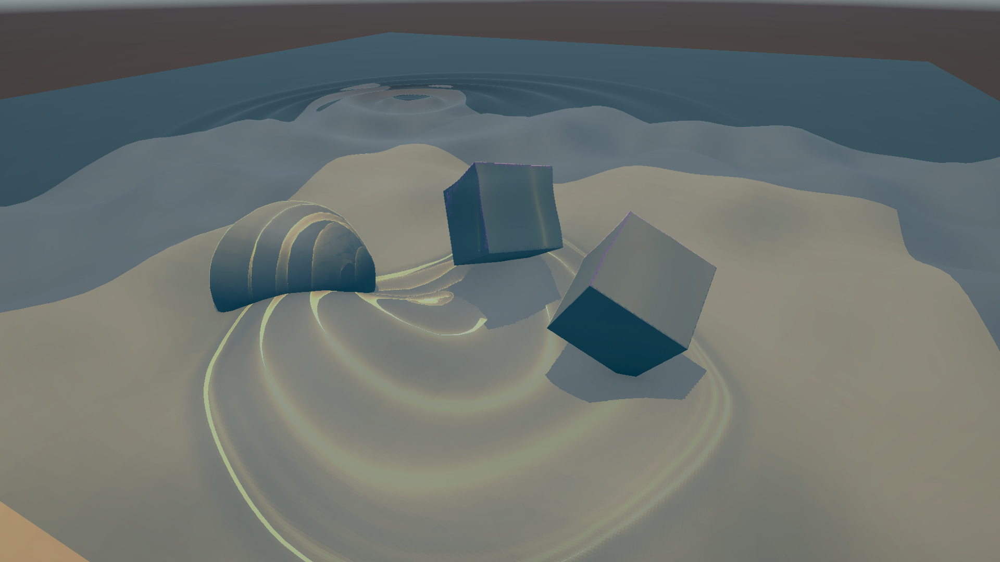
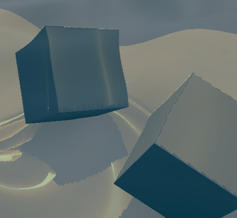
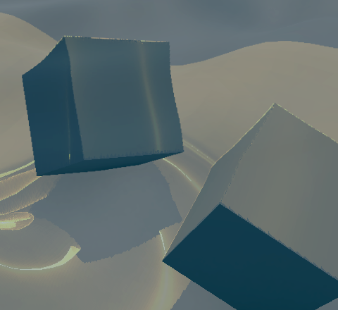

**English** | [日本語](README.ja.md)

---

# caustic-mesh-dxr

> **Real-Time Mesh-Based Caustics on Dynamic 3D Environments via DXR Inline Ray Queries & Adaptive Edge Subdivision**  
> An end-to-end GPU compute pipeline extending Evan Wallace's area-ratio caustic formulation to arbitrary dynamic 3D geometries, fully resolving geometric tearing ("flying polygons") across silhouettes and depth chasms (Unity 6 / DXR 1.1 / URP).

---

## 📄 Technical Paper / Preprint

The complete research paper detailing the mathematical formulation, geometric tearing elimination algorithm, and empirical benchmarks on an NVIDIA GeForce RTX 5070 GPU is available in Markdown format:

- 🇬🇧 **[Full Preprint (English Markdown)](docs/preprint.md)**
- 🇯🇵 **[Preprint - Japanese Translation (日本語版 Markdown)](docs/preprint_ja.md)**

**Author**: Nobuyuki Nakata

### Abstract
Mesh-based caustic rendering methods based on the incident-to-projected area ratio (Evan Wallace, 2011/2016; Yuksel & Keyser, 2009) provide physically plausible flux conservation and crisp caustic cusps at negligible computational overhead. However, existing implementations are strictly bounded to analytical receiver equations (planes or spheres) or single heightfields. When generalizing this paradigm to arbitrary 3D production environments with disjoint objects and depth steps, two critical barriers emerge: (1) real-time intersection testing against arbitrary deforming polygon meshes, and (2) geometric tearing—where projected triangles straddle disconnected instances or silhouettes, generating massive, unphysical "flying polygons" across empty space.

In this paper, we break through these structural barriers with an end-to-end GPU compute pipeline. We classify receiver instances and surface normals using hardware-accelerated inline ray queries (DXR 1.1) and perform edge-centric adaptive midpoint subdivision with GPU culling. By marrying strict Jacobian flux conservation across continuous regions with conservative sub-triangle culling across silhouettes, our system eliminates geometric tearing artifacts while bounding additional queries to the boundary perimeter ($O(\partial \Omega)$). The entire pipeline executes in 1.03–1.43 ms (>600 FPS) on an NVIDIA RTX 5070 GPU in Unity URP, delivering artifact-free, resolution-independent caustics on complex dynamic scenes.

---

## 🖼️ Eliminating Geometric Tearing: Visual Comparison

Comparison between the baseline (a naive extension of Wallace's method without edge subdivision) and the proposed method (adaptive edge subdivision + GPU culling) under continuous wave simulation (Camera Pose 03, close-up perspective).

### Full Perspective View
| (a) Subdivision OFF (Baseline: Naive Extension) | (b) Subdivision ON (Proposed Method) | (c) Boundary Highlight (Debug) |
|:---:|:---:|:---:|
| [](Captures/caustic_pose03_subdivision_off.png) | [](Captures/caustic_pose03_subdivision_on.png) | [](Captures/caustic_pose03_boundary_highlight.png) |

### Cropped Insets: Suspended Cube Silhouette & Floor Boundary
| (a) Inset: Subdivision OFF (Baseline) | (b) Inset: Subdivision ON (Proposed) | (c) Inset: Boundary Highlight (Debug) |
|:---:|:---:|:---:|
| [](Captures/caustic_pose03_inset_subdivision_off.png) | [](Captures/caustic_pose03_inset_subdivision_on.png) | [](Captures/caustic_pose03_inset_boundary_highlight.png) |
| **Severe Flying Triangles**: Massive stretched triangles bridge open air between the cube's top edges and the floor, creating prominent geometric tearing artifacts. | **Conformal Surface Snapping**: Discontinuous sub-triangles are culled on the GPU, snapping caustic illumination strictly to the cube contours and floor geometry. | **Discontinuity Classification**: Inter-instance boundaries and sharp crease edges ($\mathbf{n}_j \cdot \mathbf{n}_k < \cos 30^\circ$) are detected in magenta. |

---

## 🔬 Pipeline Architecture

```
[Input Wave Grid]  (GPU Heightfield / Wave Equation / Texture)
       │
       ▼
 [Refracted Ray Generation]  (Snell's Law: refract(L, n, η))
       │
       ▼
 [DXR 1.1 Inline RayQuery]   (TLAS query: hit pos h, normal nr, instance ID)
       │
       ▼
 [Discontinuity Detection]   (Atomic record: instance ID mismatch or normal crease)
       │
       ▼
 [Adaptive Midpoint Trace]   (Selective RayQuery on marked boundary edges: O(∂Ω))
       │
       ▼
 [Subdivision & Culling]     (1–4 sub-triangles; cross-instance triangles culled)
       │
       ▼
 [GPU Indirect Rasterization] (DrawProceduralIndirect, vector sharpness, textureless)
```

---

## ⚡ Performance Benchmarks

**Benchmark Hardware**: NVIDIA GeForce RTX 5070 (12 GB VRAM, Direct3D 12), Unity 6000.3.25f1, $1920 \times 1080$ resolution under active wave simulation.

| Grid Resolution | Cell Size | Total Triangles | Frame Time (ms) | Approx FPS |
|---|---|---|---|---|
| $16 \times 16$ | 0.2500 | 512 | **1.03 ms** | **968.1 FPS** |
| $32 \times 32$ | 0.1250 | 2,048 | **1.26 ms** | **790.6 FPS** |
| $64 \times 64$ | 0.0625 | 8,192 | **1.63 ms** | **613.6 FPS** |
| $128 \times 128$ | 0.0313 | 32,768 | **1.43 ms** | **699.4 FPS** |

- **Sub-1.5 ms GPU Execution**: Ray queries, discontinuity marking, midpoint refinement, and indirect draw generation execute in **$1.0 \sim 1.6\text{ ms}$ ($>600\text{ FPS}$)**, proving production viability.
- **Perimeter Scaling**: Restricting subdivision and midpoint tracing to discontinuous edges guarantees that computational load scales with boundary perimeter $O(\partial \Omega)$ rather than surface area $O(N^2)$, maintaining flat performance even at 32k triangles.

---

## 🛠️ Key Features

### 1. Mesh-Based Caustics Projection
- Discretizes rectangular refractive surfaces into shared-vertex triangle grids.
- Computes refraction directions via Snell's Law using directional light vectors and surface normals.
- Issues inline ray queries against a Top-Level Acceleration Structure (TLAS) containing arbitrary static and deforming meshes.
- Evaluates local irradiance directly via Jacobian area ratio (`incidentArea / receiverArea`).
- Supports additive blending and modulated additive blending (attenuated by background scene color).

### 2. Flexible Wave Height Fields
Driven by the `CausticHeightField` abstraction:
- `RadialSineHeightField`: Radial analytical sine waves.
- `TextureHeightField`: Height maps sampled from textures.
- `WaveEquationHeightField`: Real-time GPU 2D wave equation simulation.

### 3. Dynamic Receiver Geometries
- Static meshes via standard `MeshRenderer`.
- GPU-managed procedural geometries via `CausticReceiverGeometry`.
- `NoiseGridReceiverGeometry`: Real-time vertex deformation driven by GPU 3D Simplex noise.
- Aggregates multiple receiver instances into a single TLAS, with instance IDs enabling topology classification.

### 4. Boundary Adaptation & Debug Visualization
- Classifies inter-instance boundaries and sharp normal creases ($> 30^\circ$).
- Selectively retraces ray midpoints along marked boundary edges and adaptively subdivides triangles (1 to 4 sub-triangles).
- Conservatively culls invalid or bridging sub-triangles directly on the GPU.
- Visual debug modes: boundary edge highlight (magenta), source grid outline, lit surface, and refraction rays.
- GPU readback verification for ray hit validation and area conservation metrics.

---

## 💻 Prerequisites

- **Unity**: `6000.3.20f1` or later (Universal Render Pipeline `17.3.0`)
- **Graphics API**: DirectX 12 (DXR 1.1 / Tier 1.1 Ray Tracing capable GPU)
- **Shader Features**: Compute Shaders and Inline Ray Queries (`RayQuery<RAY_FLAG_NONE>`).

---

## 🚀 Getting Started

1. Open the project in Unity (`6000.3.20f1` or newer).
2. Open `Assets/Scenes/SampleScene.unity`.
3. Verify that the `CausticRayQueryTest` GameObject in the hierarchy has assigned the Directional Light, Receivers, and Compute/Raster shaders.
4. Press **Play**.

### Key Inspector Parameters (`CausticRayQueryTest`)

| Parameter | Description |
|---|---|
| `Source Size` / `Cell Size` | Dimensions and tessellation resolution of the source refractive grid |
| `Height Field` | Wave pattern generator (RadialSine / Texture / WaveEquation) |
| `Transmitted Refractive Index` | Refraction index of the medium (default `1.333` for water) |
| `Receivers` | Target receiver geometries registered into the TLAS |
| `Subdivide Receiver Boundaries` | Enable/disable boundary-adaptive edge subdivision and culling |
| `Caustic Blend Mode` | `Additive` or `Modulated Additive` |
| `Enable Validation` | Perform CPU readback validation of GPU buffers |

---

## 📂 Repository Layout

```text
caustic-mesh-dxr/
├─ Assets/Caustics/
│  ├─ Scripts/
│  │  ├─ CausticRayQueryTest.cs          # Pipeline orchestration, buffer management, indirect draw
│  │  ├─ CausticHeightField.cs            # Abstract base class for height fields
│  │  ├─ *HeightField.cs                  # Concrete wave implementations (WaveEquation, etc.)
│  │  ├─ CausticReceiverGeometry.cs       # Abstract base class for receiver geometries
│  │  ├─ NoiseGridReceiverGeometry.cs     # GPU procedural noise-deforming receiver
│  │  ├─ CausticRendererFeature.cs        # URP scriptable render pass integration
│  │  └─ Editor/
│  │     └─ CausticBenchmarkRunner.cs     # Automated benchmark and verification capture suite
│  └─ Shaders/
│     ├─ CausticRayQuery.compute          # Ray queries, edge marking, and adaptive subdivision kernels
│     ├─ NoiseGridReceiver.compute        # Procedural receiver deformation kernel
│     ├─ ProjectedCausticTriangle.shader  # Direct rasterization shader with normal biasing
│     └─ SourceGridOutline.shader         # Visual debug aid for refractive surface
├─ Captures/                              # Ground-truth comparison and evaluation captures
└─ docs/
   ├─ preprint.md                         # Full technical paper / preprint (English Markdown)
   ├─ preprint_ja.md                      # Full technical paper / preprint (Japanese Markdown)
   ├─ architecture.md                     # Deep architectural design specification
   └─ benchmark_results.md                # Raw benchmark performance records
```

---

## 📚 Documentation & References

- 🇬🇧 [Technical Paper / Preprint (English)](docs/preprint.md)
- 🇯🇵 [プレプリント本文 (日本語版)](docs/preprint_ja.md)
- 📐 [Architectural Design Specification (architecture.md)](docs/architecture.md)
- 📊 [Benchmark Results & Evaluation (benchmark_results.md)](docs/benchmark_results.md)
- 📝 [Changelog (CHANGELOG.md)](CHANGELOG.md)


